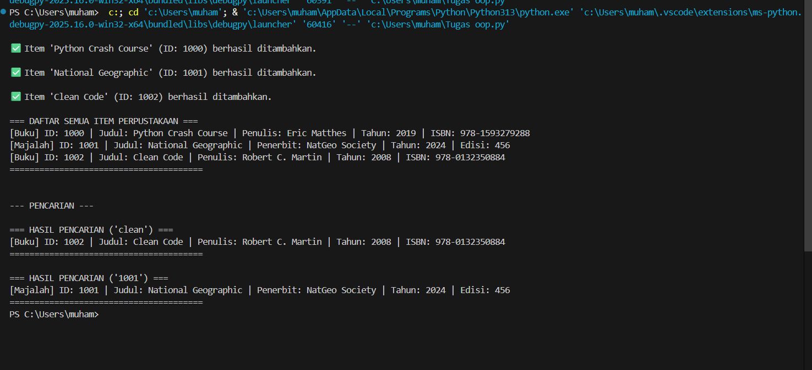

# 📚 Sistem Manajemen Perpustakaan Sederhana

Sistem ini adalah aplikasi konsol sederhana yang dikembangkan menggunakan Python dengan fokus implementasi pada konsep Object-Oriented Programming (OOP). Program ini dirancang untuk mengelola koleksi item perpustakaan seperti Buku dan Majalah.

---

## ⚙️ Fitur Aplikasi
✅ Pencatatan Item
✅ Menampilkan Koleksi
✅ Pencarian Item  
✅ Keamanan Data

---
## Struktur Class (Diagram Class)
Struktur program dirancang berdasarkan prinsip OOP yang kuat, memastikan kode modular dan mudah dikelola.

Penjelasan Struktur Class
LibraryItem (Abstract Class): Kelas dasar abstrak yang mendefinisikan properti inti (judul, tahun, ID) dan metode yang harus dimiliki oleh setiap item perpustakaan (display_info() dan get_type()).

Book & Magazine (Subclass): Kelas konkret yang mewarisi dari LibraryItem dan mengimplementasikan metode abstrak, serta menambahkan atribut spesifik seperti isbn (untuk Buku) atau issue_number (untuk Majalah).

Library: Kelas manajer yang bertanggung jawab untuk menyimpan, menambahkan, menampilkan, dan mencari objek LibraryItem.

---
## Screenshot Hasil Running Program
Berikut adalah screenshot dari hasil running:

  
